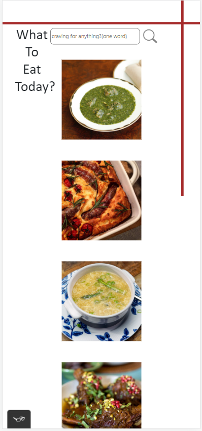
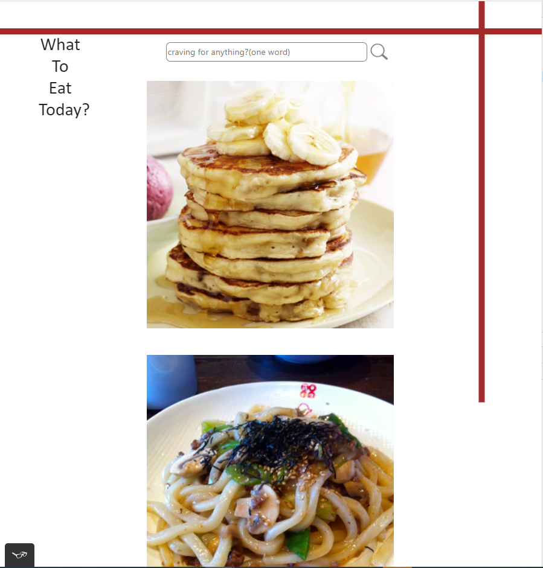
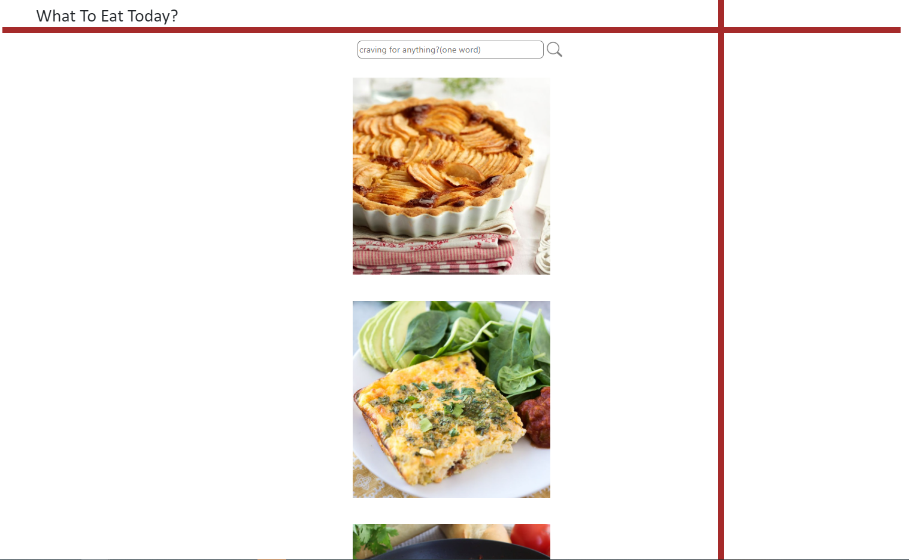

# what-to-eat-today-App

## Table of contents

- [Overview](#overview)
  - [The challenge](#the-challenge)
  - [Screenshot](#screenshot)
  - [Links](#links)
  - [Built with](#built-with)
  - [What I learned](#what-i-learned)
  - [Continued development](#continued-development)
- [Author](#author)

## Overview

This is an app that aiming to help people decide what they can eat in a day. To inspire people for food selections, especially to help people with Phobia of choice and also helping foodies to find out fun fact of food around the world. 

### The challenge

Users should be able to:

- View the optimal layout for the component depending on their device's screen size
- See hover states for all interactive elements on the page
- Search for food they are craving at the moment
- Click into the picture to see the details of that spefic food
- Able to reload a new set of contents if nothing interests the user
- All element on the site is accessible for screen readers
- Element works on all device and browsers

### Screenshot

### Links

- Solution URL: [https://github.com/sunnyyuanz/what-to-eat-today-App]
- Live Site URL: [https://sunnyyuanz.github.io/what-to-eat-today-App/]

### Built with

- Semantic HTML5 markup
- CSS custom properties
- Flexbox
- CSS Grid
- Javascript
- FetchAPI
- Bootstrap
- Polyfill

### What I learn
- Working with a real API
- Use bootstrap for styling
- Include all code in an IIFE to avoid accidentally accessing the global state
- Build modal

### Continued development

Looking forward to built this or enhance this with react JS. It would be cool if the youtube video can be embeded into the modal. And I would enhance the search tool better in the filter that users can search by areas or categories. Also, add an animated loading status for users with slower internet. 

## Author

- GitHub - [SunnyZ](https://github.com/sunnyyuanz)
- Portfolio Website - [SunnyZ](http://www.sunnyzportfolio.com/)

